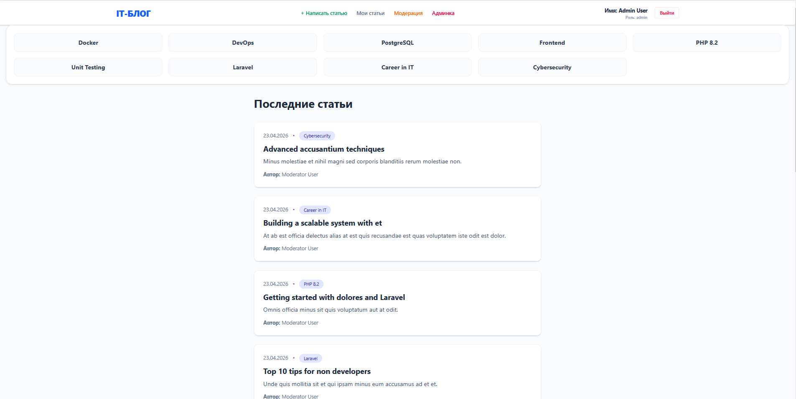
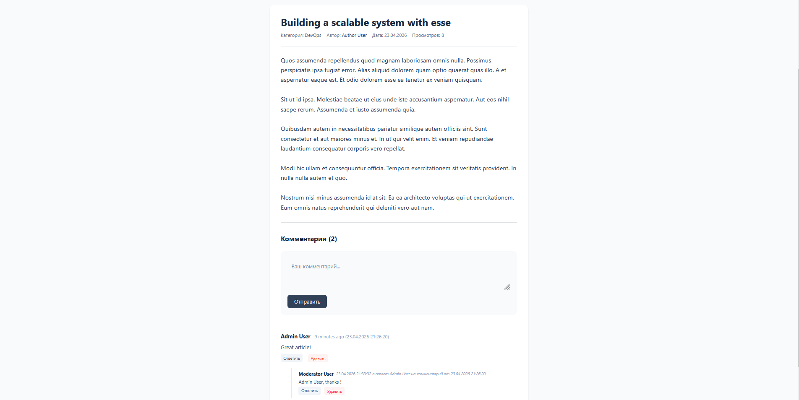
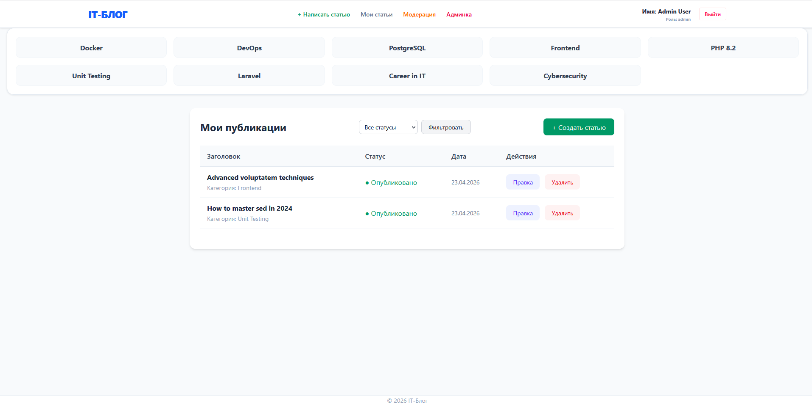
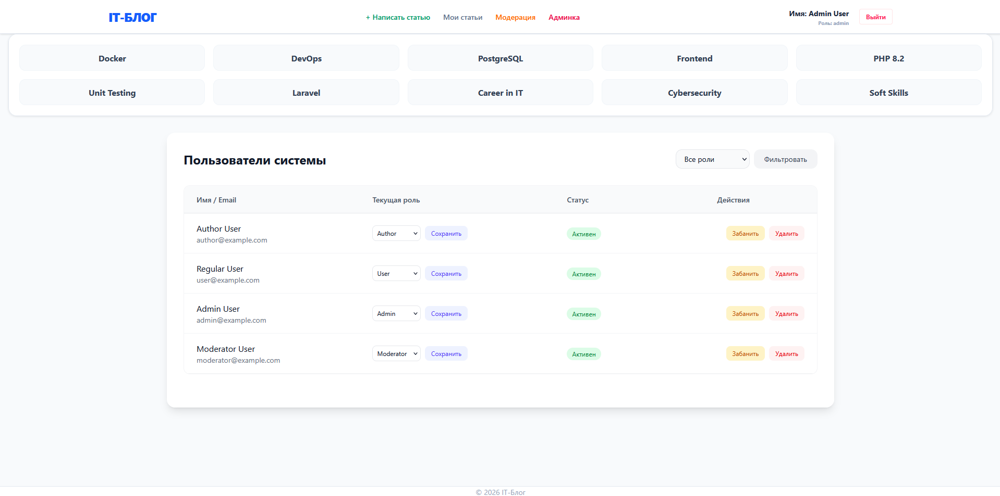

# 📚 IT-Блог

## 📖 Описание проекта

IT-Блог — это учебный проект интернет-блога с полноценной системой управления пользователями, статьями и комментариями. Проект демонстрирует возможности Laravel в построении многоуровневых систем с ролевой моделью доступа.

## 🚀 Основной функционал

### 👥 Пользователи и роли

- **Пользователь** — может читать статьи и оставлять комментарии
- **Автор** — может создавать статьи, редактировать их и отправлять на модерацию
- **Модератор** — может одобрять или отклонять статьи с комментарием
- **Администратор** — полный доступ: управление пользователями, ролями, баном

### 📝 Статьи

- Создание, редактирование, удаление статей
- Статусы: черновик, на проверке, опубликовано, отклонено
- Категории статей
- Краткое описание и полный текст
- Дата публикации

### 💬 Комментарии

- Вложенные комментарии (ответы на ответы)
- Возможность отвечать на любой комментарий
- Удаление своих комментариев

### 🛡️ Модерация

- Очередь статей на проверку
- Принятие/отклонение с указанием причины
- Замечания модератора видны автору

### 👑 Администрирование

- Управление пользователями
- Смена ролей
- Бан / разбан пользователей
- Удаление пользователей

## 🛠️ Технологический стек

| Технология | Назначение |
|------------|---------|
| Laravel 12 | Основной PHP-фреймворк |
| MySQL | Реляционная база данных |
| Tailwind CSS | Современная стилизация интерфейса |
| Alpine.js | Легковесная интерактивность на клиенте |
| Livewire | Реактивные компоненты (Full-stack Laravel) |
| Vite | Сборка фронтенд-ресурсов |
| Docker | Контейнеризация среды разработки |


## 🖼️ Интерфейс

### Главная страница


### Просмотр статьи и комментариев


### Личный кабинет автора


### Панель администратора



## 📦 Установка и запуск (Docker)
Это рекомендуемый способ запуска. Локальная установка PHP/MySQL не требуется.

1. Клонируйте проект и настройте окружение:

```bash
    git clone https://github.com/KOSTYA0003/blog-it.git
```

```bash
    cd blog-it
```

```bash
    cp .env.example .env # Для Windows: copy .env.example .env
```

Убедитесь, что в .env настройки БД соответствуют Docker: DB_HOST=db, DB_PASSWORD=root

2. Запустите контейнеры:

```bash
    docker-compose up -d --build
```

3. Установите зависимости и настройте приложение:

```bash
    docker exec -it it-blog-app composer install
```

```bash
    docker exec -it it-blog-app php artisan key:generate
```

```bash
    docker exec -it it-blog-app npm install --force
```

```bash
    docker exec -it it-blog-app npm run build
```

4. Выполните миграции и наполните базу данными:

```bash
    docker exec -it it-blog-app php artisan migrate:fresh --seed
```

**Доступ к приложению:**
- Сайт: [http://localhost:8000](http://localhost:8000)
- База данных (phpMyAdmin): [http://localhost:8081](http://localhost:8081)


## 👤 Тестовые пользователи

После выполнения `php artisan migrate:fresh --seed` будут доступны следующие аккаунты:

| Email | Пароль | Роль  |
| :--- | :--- | :--- |
| **user@example.com** | `password` | Пользователь (User) |
| **author@example.com** | `password` | Автор (Author) |
| **moderator@example.com** | `password` | Модератор (Moderator) |
| **admin@example.com** | `password` | Администратор (Administrator) |

## 📄 Лицензия
MIT
